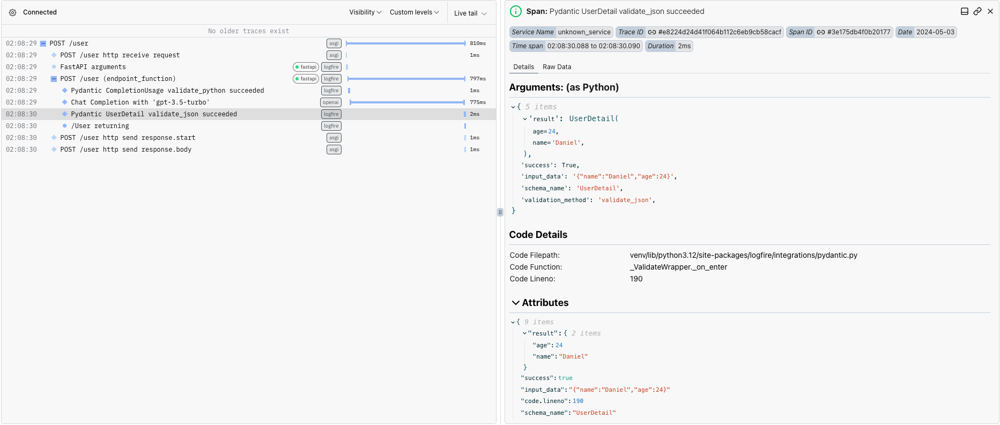
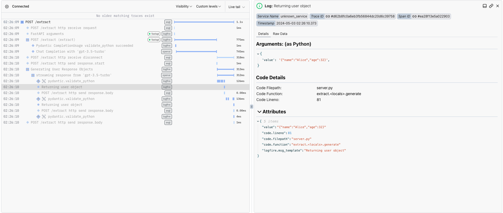

# Why Logfire is a perfect fit for FastAPI + Instructor

Logfire is a new tool that provides key insight into your application with Open Telemtry. Instead of using ad-hoc print statements, Logfire helps to profile every part of your application and is integrated directly into Pydantic and FastAPI, two popular libraries amongst Instructor users.

In short, this is the secret sauce to help you get your application to the finish line and beyond. We'll show you how to easily integrate Logfire into FastAPI, one of the most popular choices amongst users of Instructor using two examples

1. Data Extraction from a single User Query
2. Streaming multiple objects using an `Iterable` so that they're avaliable on demand

<!-- more -->

As usual, all of the code that we refer to here is provided in [examples/logfire-fastapi](https://www.github.com/jxnl/instructor/tree/main/examples/logfire-fastapi) for you to use in your projects.

??? info "Configure Logfire"

    Before starting this tutorial, make sure that you've registered for a [Logfire](https://logfire.pydantic.dev/) account. You'll also need to create a project to track these logs. Lastly, in order to see the request body, you'll also need to configure the default log level to `debug` instead of the default `info` on the dashboard console.

Make sure to create a virtual environment and install all of the packages inside the `requirements.txt` file at [examples/logfire-fastapi](https://www.github.com/jxnl/instructor/tree/main/examples/logfire-fastapi).

## Data Extraction

Let's start by trying to extract some user information given a user query. We can do so with a simple Pydantic model as seen below.

```python
from pydantic import BaseModel
from fastapi import FastAPI
from openai import AsyncOpenAI
import instructor


class UserData(BaseModel):
    query: str


class UserDetail(BaseModel):
    name: str
    age: int


app = FastAPI()
client = instructor.from_openai(AsyncOpenAI())


@app.post("/user", response_model=UserDetail)
async def endpoint_function(data: UserData) -> UserDetail:
    user_detail = await client.chat.completions.create(
        model="gpt-3.5-turbo",
        response_model=UserDetail,
        messages=[
            {"role": "user", "content": f"Extract: `{data.query}`"},
        ],
    )

    return user_detail

```

This simple endpoint takes in a user query and extracts out a user from the statement. Let's see how we can add in Logfire into this endpoint with just a few lines of code

```python hl_lines="5 18-21"
from pydantic import BaseModel
from fastapi import FastAPI
from openai import AsyncOpenAI
import instructor
import logfire #(1)!


class UserData(BaseModel):
    query: str


class UserDetail(BaseModel):
    name: str
    age: int


app = FastAPI()
openai_client = AsyncOpenAI() #(2)!
logfire.configure(pydantic_plugin=logfire.PydanticPlugin(record="failure"))
client = instructor.from_openai(openai_client)
logfire.instrument_fastapi(app)
client = instructor.from_openai(openai_client)


@app.post("/user", response_model=UserDetail)
async def endpoint_function(data: UserData) -> UserDetail:
    user_detail = await client.chat.completions.create(
        model="gpt-3.5-turbo",
        response_model=UserDetail,
        messages=[
            {"role": "user", "content": f"Extract: `{data.query}`"},
        ],
    )

    return user_detail
```

1. Import in the logfire package
2. Setup logging using their native integrations with FastAPI and OpenAI

With just those few lines of code, we've got ourselves a working integration with Logfire. When we call our endpoint at `/user` with the following payload, everything is immediately logged in the console.

```bash
curl -X 'POST' \
  'http://localhost:3000/user' \
  -H 'accept: application/json' \
  -H 'Content-Type: application/json' \
  -d '{
  "query": "Daniel is a 24 year man living in New York City"
}'
```

We can see that Pydantic has nicely logged for us the result of our `UserDetail` schema validation



We've also got full visibility into the arguments that were passed into the endpoint when we called it. This is extremely useful for users when they eventually want to reproduce errors in production locally.


## Streaming

Now that we've covered a simple data extraction endpoint, let's see how we can take advantage of Instructor's `Iterable` support to stream multiple instances of an extracted object. This is extremely useful for application where speed is crucial and users want to get the results quickly.

Let's add a new endpoint to our server to see how this might work

```python hl_lines="6-7 40-59"
from pydantic import BaseModel
from fastapi import FastAPI
from openai import AsyncOpenAI
import instructor
import logfire
from collections.abc import Iterable #(1)!
from fastapi.responses import StreamingResponse


class UserData(BaseModel):
    query: str


class UserDetail(BaseModel):
    name: str
    age: int


app = FastAPI()
openai_client = AsyncOpenAI()
logfire.configure(pydantic_plugin=logfire.PydanticPlugin(record="failure"))
client = instructor.from_openai(openai_client)
logfire.instrument_fastapi(app)
client = instructor.from_openai(openai_client)


@app.post("/user", response_model=UserDetail)
async def endpoint_function(data: UserData) -> UserDetail:
    user_detail = await client.chat.completions.create(
        model="gpt-3.5-turbo",
        response_model=UserDetail,
        messages=[
            {"role": "user", "content": f"Extract: `{data.query}`"},
        ],
    )

    return user_detail


@app.post("/extract", response_class=StreamingResponse)
async def extract(data: UserData):
    users = await client.chat.completions.create(
        model="gpt-3.5-turbo",
        response_model=Iterable[UserDetail],
        stream=True,
        messages=[
            {"role": "user", "content": data.query},
        ],
    )

    async def generate(): #(2)!
        with logfire.span("Generating User Response Objects"):
            async for user in users:
                resp_json = user.model_dump_json()
                logfire.info("Returning user object", value=resp_json)

                yield resp_json

    return StreamingResponse(generate(), media_type="text/event-stream")
```

1. Import in the Iterable and Streaming Response so that we are able to return a stream to the user
2. Define a generator which will return the individual instances of the `UserDetail` object

We can call and log out the stream returned using the `requests` library and using the `iter_content` method

```python
import requests

response = requests.post(
    "http://127.0.0.1:3000/extract",
    json={
        "query": "Alice and Bob are best friends. They are currently 32 and 43 respectively. "
    },
    stream=True,
)

for chunk in response.iter_content(chunk_size=1024):
    if chunk:
        print(str(chunk, encoding="utf-8"), end="\n")

```

This gives us the output of

```bash
{"name":"Alice","age":32}
{"name":"Bob","age":43}
```

We can also see the individual stream objects inside the Logfire dashboard as seen below. Note that we've grouped the generated logs inside a span of its own for easy logging.


