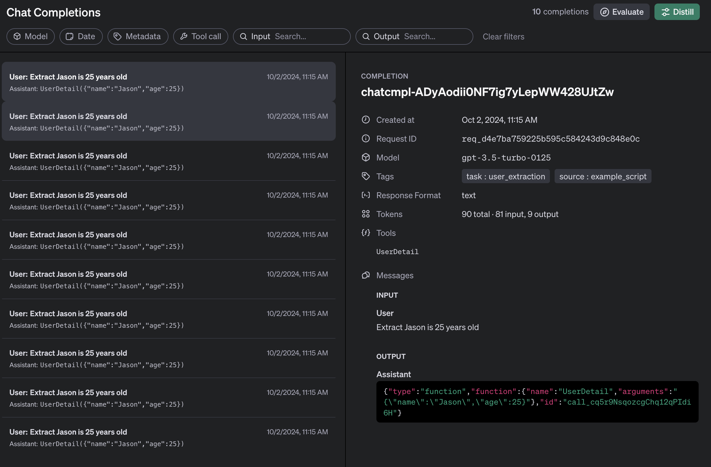

# OpenAI API Model Distillation with Instructor

OpenAI has recently introduced a new feature called [API Model Distillation](https://openai.com/index/api-model-distillation/), which allows developers to create custom models tailored to their specific use cases. This feature is particularly powerful when combined with Instructor's structured output capabilities. In this post, we'll explore how to leverage API Model Distillation with Instructor to create more efficient and specialized models.

<!-- more -->

## What is API Model Distillation?

API Model Distillation is a process that allows you to create a smaller, more focused model based on the inputs and outputs of a larger model. This distilled model can be more efficient and cost-effective for specific tasks while maintaining high performance.

## Using Instructor with API Model Distillation

Instructor's integration with OpenAI's API makes it seamless to use API Model Distillation. Here's how you can get started, make sure you have the latest version of OpenAI!

```
pip install -U openai
```

```python
import instructor
from openai import OpenAI
from pydantic import BaseModel

# Enable response_model and API Model Distillation
client = instructor.patch(OpenAI())

class UserDetail(BaseModel):
    name: str
    age: int

    def introduce(self):
        return f"Hello, I'm {self.name} and I'm {self.age} years old"

# Use the store parameter to enable API Model Distillation
user: UserDetail = client.chat.completions.create(
    model="gpt-3.5-turbo",
    response_model=UserDetail,
    messages=[
        {"role": "user", "content": "Extract Jason is 25 years old"},
    ],
    store=True  # Enable API Model Distillation
)
```

In this example, we've added the `store=True` parameter to the `chat.completions.create` method. This enables API Model Distillation for this specific call.

## Metadata and Proxy Kwargs

One of the great advantages of using Instructor with API Model Distillation is that it automatically handles metadata and proxies kwargs to the underlying OpenAI API. This means you can use additional parameters supported by the [OpenAI API](https://platform.openai.com/docs/api-reference) without any extra configuration.

For example, you can add metadata to your API calls:

```python
user: UserDetail = client.chat.completions.create(
    model="gpt-3.5-turbo",
    response_model=UserDetail,
    messages=[
        {"role": "user", "content": "Extract Jason is 25 years old"},
    ],
    store=True,
    metadata={
        "task": "user_extraction",
        "source": "customer_support_chat"
    }
)
```

The `metadata` parameter will be automatically passed to the OpenAI API, allowing you to track and organize your API calls for distillation purposes.


## Completions Dashboard

To better understand how API Model Distillation works with Instructor, let's take a look at the following diagram:



This image illustrates the process of API Model Distillation when using Instructor with OpenAI's API. It shows how the structured output from Instructor, combined with metadata and other parameters, feeds into the distillation process to create a specialized model tailored to your specific use case.

The diagram highlights:

1. The initial request with structured output using Instructor
2. The inclusion of metadata and additional parameters
3. The distillation process that creates a specialized model
4. The resulting distilled model that can be used for faster, more efficient responses

This visual representation helps to clarify the flow and benefits of using API Model Distillation in conjunction with Instructor's capabilities.


## Benefits of Using Instructor with API Model Distillation

1. **Structured Output**: Instructor's use of [Pydantic](https://docs.pydantic.dev/) models ensures that your distilled model produces structured, validated output.
2. **Simplified Integration**: The proxy kwargs feature means you can use all OpenAI API parameters without additional configuration.
3. **Improved Efficiency**: By distilling models for specific tasks, you can reduce latency and costs for your applications.
4. **Consistency**: Distilled models can provide more consistent outputs for specialized tasks.

## Conclusion

API Model Distillation, combined with Instructor's structured output capabilities, offers a powerful way to create efficient, specialized models. By leveraging Instructor's seamless integration with OpenAI's API, you can easily incorporate this feature into your existing workflows, improving both performance and cost-effectiveness of your AI-powered applications.

Remember to check [OpenAI's documentation](https://platform.openai.com/docs) for the latest information on API Model Distillation and best practices for creating and using distilled models.

For more information on using Instructor, visit the [Instructor GitHub repository](https://github.com/jxnl/instructor) and give it a star if you find it helpful!
