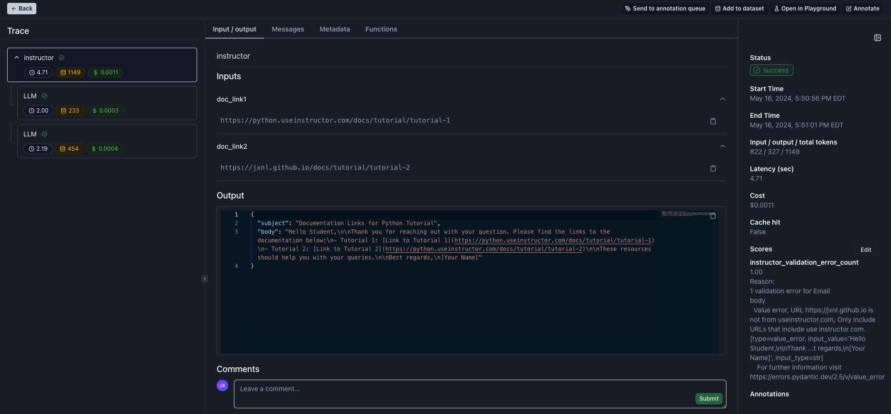

# Best Support with Parea

[Parea](https://www.parea.ai) is a platform that enables teams to monitor, collaborate, test & label for LLM applications. In this blog we will explore how Parea can be used to enhance the OpenAI client alongside `instructor` and debug + improve instructor calls.

<!-- more -->

## Parea

In order to use Parea, you first need to create an account and a [Parea API key](https://docs.parea.ai/api-reference/authentication).

Next, you will need to install the Parea SDK:

```
pip install -U parea-ai instructor
```

[//]: # (If you want to pull this example down from [instructor-hub]&#40;../../hub/index.md&#41; you can use the following command:)

[//]: # ()
[//]: # (```bash)

[//]: # (instructor hub pull --slug batch_classification_langsmith --py > batch_classification_langsmith.py)

[//]: # (```)

In this example we'll use the `wrap_openai` function to wrap the OpenAI client with Parea. This will allow us to use Parea's observability and monitoring features with the OpenAI client. Then we'll use `instructor` to patch the client with the `TOOLS` mode. This will allow us to use `instructor` to add additional functionality to the client. We'll use `instructor` to write emails with URLs from the `instructor` docs.

```python
import os

import instructor
import requests
from dotenv import load_dotenv
from openai import OpenAI
from pydantic import BaseModel, field_validator, Field
import re
from parea import Parea

load_dotenv()

client = OpenAI()

p = Parea(api_key=os.getenv("PAREA_API_KEY"))
p.wrap_openai_client(client, "instructor")

client = instructor.from_openai(client)


class Email(BaseModel):
    subject: str
    body: str = Field(
        ...,
        description="Email body, Should contain links to instructor documentation. ",
    )

    @field_validator("body")
    def check_urls(cls, v):
        urls = re.findall(r"https?://(?:[-\w.]|(?:%[\da-fA-F]{2}))+", v)
        errors = []
        for url in urls:
            if not url.startswith("https://python.useinstructor.com"):
                errors.append(
                    f"URL {url} is not from useinstructor.com, Only include URLs that include use instructor.com. "
                )
            response = requests.get(url)
            if response.status_code != 200:
                errors.append(
                    f"URL {url} returned status code {response.status_code}. Only include valid URLs that exist."
                )
            elif "404" in response.text:
                errors.append(
                    f"URL {url} contained '404' in the body. Only include valid URLs that exist."
                )
        if errors:
            raise ValueError("\n".join(errors))
        return 


def main():
    email = client.messages.create(
        model="gpt-3.5-turbo",
        max_tokens=1024,
        max_retries=3,
        messages=[
            {
                "role": "user",
                "content": "I'm responding to a student's question. Here is the link to the documentation: {{doc_link1}} and {{doc_link2}}",
            }
        ],
        # Parea supports templated prompts with {{...}} syntax
        template_inputs={
            "doc_link1": "https://python.useinstructor.com/docs/tutorial/tutorial-1",
            "doc_link2": "https://jxnl.github.io/docs/tutorial/tutorial-2",
        },
        response_model=Email,
    )
    print(email)


if __name__ == "__main__":
    main()
```

If you follow what we've done, Parea has wrapped the client and proceeded to write emails with links from the instructors docs. This is a simple example of how you can use Parea to enhance the OpenAI client. You can use Parea to monitor and observe the client, and use `instructor` to add additional functionality to the client.

To take a look at trace of this execution checkout the screenshot below. Noticeable:

- left sidebar: all related LLM calls are grouped under a trace called `instructor`
- middle section: the root trace visualizes the `templated_inputs` as inputs and the created `Email` object as output
- bottom of right sidebar: any validation errors are captured and tracked as score for the trace which enables visualizing them in dashboards and filtering by them on tables



## Label Responses for Fine-Tuning

Sometimes you may want to let subject-matter experts (SMEs) label responses to use them for fine-tuning. Parea provides a way to do this via an annotation queue. Editing raw JSON objects to correct tool use & function calling responses can be error-prone, esp. for non-devs. For that purpose, Parea has a so-called [Form Mode](https://docs.parea.ai/manual-review/overview#labeling-function-calling-tool-use-responses) which allows the user to safely fill-out a form instead of editing the JSON object. The labeled data can then be exported and used for fine-tuning.


