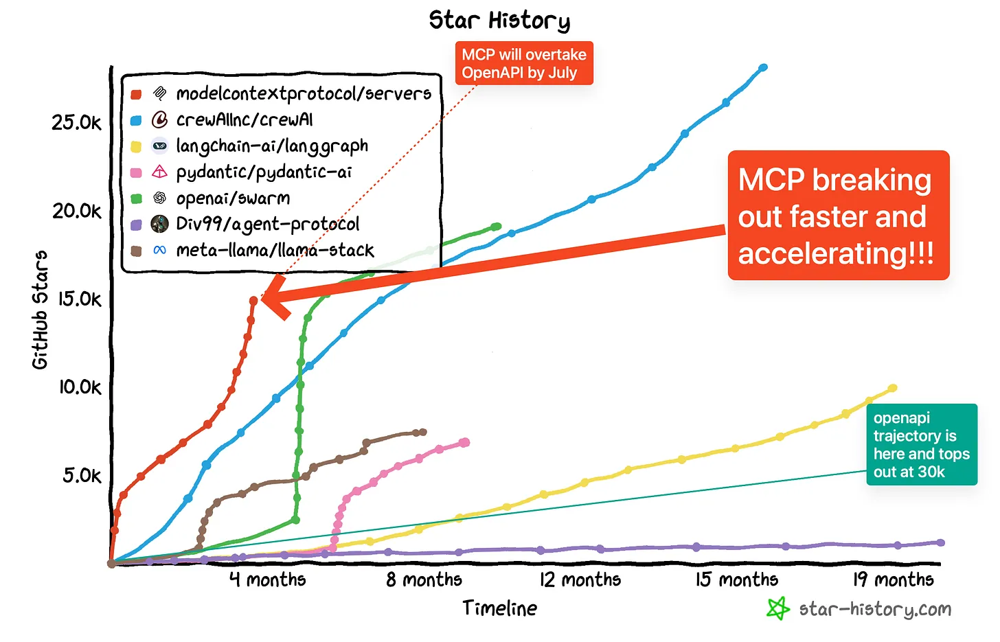
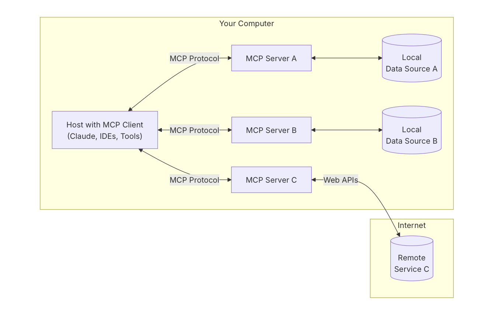
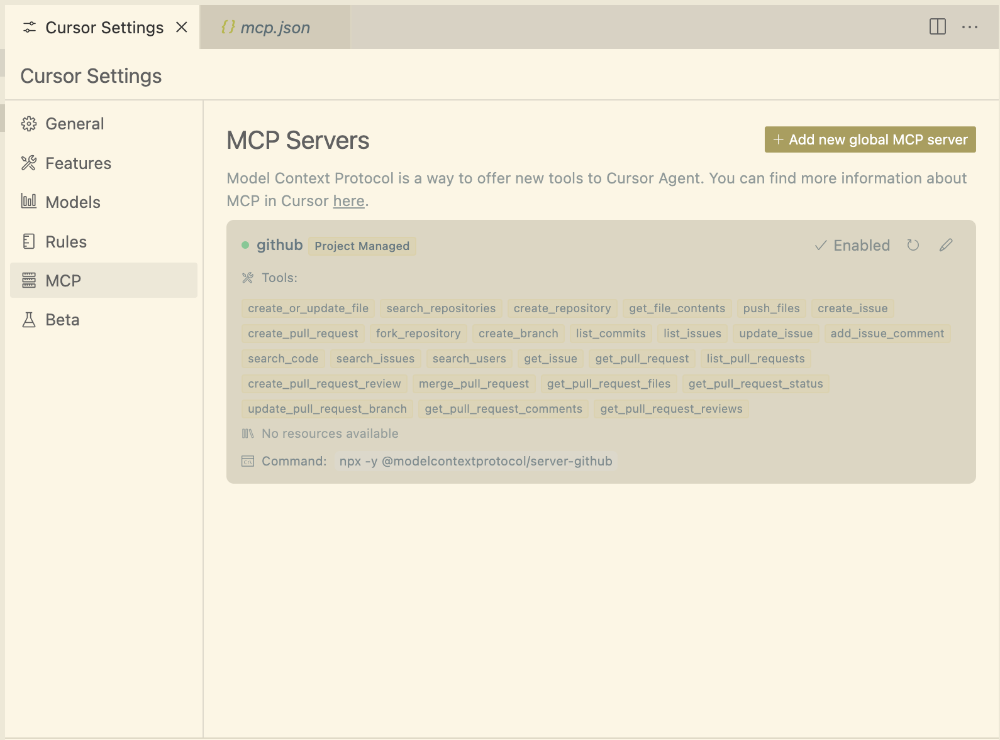

---
authors:
  - ivanleomk
categories:
  - OpenAI
comments: true
date: 2025-03-27
description: What's the big deal with OpenAI releasing MCP support
draft: false
tags:
  - LLM
  - MCPs
---

# Are Structured Outputs still relevant with MCPs?

With [OpenAI joining Anthropic in supporting the Model Context Protocol (MCP)](https://x.com/sama/status/1904957253456941061), we're witnessing a unified standard for language models to interact with external systems. This creates exciting opportunities for multi-LLM architectures where specialized AI applications work in parallel—discovering tools, handing off tasks, and accessing powerful capabilities through standardized interfaces.

This makes the structured outputs provided by Instructor more relevant than ever as MCP adoption accelerates. We need reliable results, especially as these MCP applications get more complex. From inconsistent outputs across providers to exhibit unpredictable tool invocation patterns and even practical limits on how many tools models can effectively manage, reliability is key.

In short rather than diminishing the need for structured outputs, MCPs make them more essential than ever. By providing a validation layer that ensures consistent outputs across different LLM providers, Instructor enables truly composable AI systems where multiple specialized agents can collaborate reliably on complex workflows.

<!-- more -->

## Market Signals: Growing Adoption

The adoption curve for MCP has been remarkably steep since its introduction

- [Almost 3000 community-built MCP servers have emerged in just a few months](https://smithery.ai)
- Major platforms like Zed, Cursor, Perser, and Windsurf have become MCP Hosts
- Companies including Cloudflare have released official [MCP suport with features such as OAuth](https://blog.cloudflare.com/remote-model-context-protocol-servers-mcp/) for developers to start building great applications.

Just take a look at this chart by the [Latent Space Podcast](https://www.latent.space/p/why-mcp-won)



With both OpenAI and Anthropic supporting MCP, we now have a unified approach spanning the two most advanced AI model providers. This critical mass suggests MCP is positioned to become the dominant standard for AI tool integration.

## What is MCP and why does it matter

MCP is an open protocol developed by Anthropic that standardizes how AI models and applications interact with external tools, data sources, and systems. It solves the fragmentation problem where teams build custom implementations for AI integrations by providing a standardized interface layer.

There are three components to the MCP ecosystem

1. Hosts: Programs like Claude Desktop, IDEs, or AI tools that want to access data through MCP
2. Clients: Protocol clients that maintain 1:1 connections with servers
3. Servers: Lightweight programs that each expose specific capabilities through the standardized Model Context Protocol

We can see this below in the diagram from the official MCP documentation



When interacting with Clients, Hosts have access to the following options

1. Tools (model-controlled functions that retrieve or modify data)
2. Resources (application-controlled data like files)

There's also the intention of allowing servers themselves also have the capability of requesting completions/approval from Clients and Hosts while executing their tasks [through the `sampling` endpoint](https://modelcontextprotocol.io/docs/concepts/sampling).

This standardization means any MCP-compatible client can connect to any MCP server without additional work, eliminating the "N times M" integration problem. Before MCP, integrating AI applications with external tools and systems created what's known as an "M×N problem":

- If you have M different AI applications (Claude, ChatGPT, custom agents, etc.)
- And N different tools/systems (GitHub, Slack, Asana, databases, etc.)
- You would need to build M×N different integrations

This leads to:

1. Duplicated effort across teams
2. Inconsistent implementations
3. Maintenance burden that grows quadratically

MCP transforms this into an "M+N problem":

1. Tool creators build N MCP servers (one for each system)
2. Application developers build M MCP clients (one for each AI application)
3. The total integration work becomes M+N instead of M×N

This means a team can build a GitHub MCP server once, and it will work with any MCP-compatible client. Similarly, once you've built an MCP-compatible agent, it can immediately work with all existing MCP servers without additional integration work.

The advantages extend beyond just integration efficiency:

1. **Future-proofing**: As MCP becomes more widely adopted, servers built today will be compatible with tomorrow's clients
2. **Reduced fragmentation**: Instead of building custom implementations for each AI platform, you can focus on a single standard
3. **Composability**: MCP servers can be chained together, allowing for complex workflows and agent systems
4. **Remote capabilities**: The upcoming support for remote-hosted MCP servers will vastly expand distribution possibilities

## Moving Beyond Simple Actions to Semantic Tasks

As MCP integrations mature, we're moving toward a paradigm shift in how tools are presented to models. Rather than just exposing simple action-based tools (add-branch, delete-branch, create-PR), we'll increasingly build MCP clients that understand higher-level tasks and goals.

Instructor makes this possible by providing validated structured outputs for a variety of differnet providers, making it simple and easy for you to choose the best model for your task and know with confidence the ability of your MCP server to handle these tasks.

```python
import instructor
from openai import OpenAI
from pydantic import BaseModel
from typing import Union, Literal, List
import pytest

# Define structured models for different git actions
class GitCommit(BaseModel):
    action_type: Literal["commit"]
    message: str
    files: List[str] = []

class GitPR(BaseModel):
    action_type: Literal["create_pr"]
    title: str
    description: str
    branch_name: str

class GitMerge(BaseModel):
    action_type: Literal["merge"]
    source_branch: str
    target_branch: str
    commit_message: str

class GitLog(BaseModel):
    action_type: Literal["log"]
    num_commits: int = 1
    branch: str = "current"

# Union type for all possible git actions
GitAction = Union[GitCommit, GitPR, GitMerge, GitLog]

# Test cases with expected action types
test_cases = [
    ("Create a PR for the features I've been working on", GitPR),
    ("Commit everything in the current directory", GitCommit),
    ("Merge my branch into main after checking tests pass", GitMerge),
    ("Show me what changed in the last 3 commits", GitLog)
]

# Validate that our model correctly interprets semantic tasks
def test_git_task_interpretation():
    client = instructor.from_openai(OpenAI())

    for query, expected_type in test_cases:
        action = client.chat.completions.create(
            model="gpt-4o-mini",
            response_model=GitAction,
            messages=[
                {"role": "system", "content": "Interpret git-related tasks and return the appropriate structured action"},
                {"role": "user", "content": query}
            ]
        )

        assert isinstance(action, expected_type), f"Failed on: {query}. Got {type(action)} instead of {expected_type}"
        print(f"✓ Correctly mapped '{query}' to {action.action_type} action")

        # We can also validate specific fields are properly populated
        if isinstance(action, GitCommit):
            assert action.message, "Commit message should not be empty"
        elif isinstance(action, GitPR):
            assert action.title and action.description, "PR should have title and description"
```

This approach delivers three crucial benefits for MCP developers:

1. **Testability**: You can systematically verify how your system maps natural language to specific structured actions
2. **Consistency**: The same semantic intents produce consistent structured outputs across different LLM providers
3. **Transparency**: Action requests and interpretations can be logged and analyzed to improve system performance

By combining MCP's standardized protocol with Instructor's structured output validation, you can build robust integration layers that understand natural language task descriptions while maintaining enterprise-grade reliability.

Throw in some synthetic data to fuzz and test the capabilities of our model and you now have a way to systematically improve and quantify the impact of every component of your MCP server.

## Getting Started With MCP Development

Now that we've briefly talked a bit about where MCPs are headed and why you should care about them, let's see some simple examples on how to get started. We'll go through three here - Claude Desktop, Cursor and the OpenAI Agent SDK.

The learning curve for MCP is relatively gentle—many servers are less than 200 lines of code and can be built in under an hour. Before diving into building custom servers, let's look at how you can get started by leveraging existing MCP integrations.

### Agent SDK

OpenAI's Agent SDK now supports MCP servers using the `MCPServer` class. This allows you to connect your agents to local Git repositories and other tools. In the example below, we've provided our agent with a `git` MCP server, allowing it to access information about the local github repository.

```python
import asyncio
import shutil

from agents import Agent, Runner, trace
from agents.mcp import MCPServer, MCPServerStdio


async def run(mcp_server: MCPServer, directory_path: str):
    agent = Agent(
        name="Assistant",
        instructions=f"Answer questions about the git repository at {directory_path}, use that for repo_path",
        mcp_servers=[mcp_server],
    )

    question = input("Enter a question: ")

    print("\n" + "-" * 40)
    print(f"Running: {question}")
    result = await Runner.run(starting_agent=agent, input=question)
    print(result.final_output)

    message = "Summarize the last change in the repository."
    print("\n" + "-" * 40)
    print(f"Running: {message}")
    result = await Runner.run(starting_agent=agent, input=message)
    print(result.final_output)


async def main():
    # Ask the user for the directory path
    directory_path = input("Please enter the path to the git repository: ")

    async with MCPServerStdio(
        cache_tools_list=True,  # Cache the tools list, for demonstration
        params={"command": "uvx", "args": ["mcp-server-git"]},
    ) as server:
        with trace(workflow_name="MCP Git Example"):
            await run(server, directory_path)


if __name__ == "__main__":
    if not shutil.which("uvx"):
        raise RuntimeError(
            "uvx is not installed. Please install it with `pip install uvx`."
        )

    asyncio.run(main())

```

We can now use the Agents SDK to understand our local git repository and what changes we've introduced as seen below.


### Claude Desktop

Claude Desktop now supports MCP integrations, allowing Claude to access up-to-date information through tools like Firecrawl. You can add these MCPs by going to Claude's Settings and editing the configuration there


This is incredibly useful and allows you to point Claude to specific websites or urls to get up to date information. You can install Firecrawl's MCP by using the following configuration

```
{
  "mcpServers": {
    "mcp-server-firecrawl": {
      "command": "npx",
      "args": ["-y", "firecrawl-mcp"],
      "env": {
        "FIRECRAWL_API_KEY": "YOUR_API_KEY_HERE",
      }
    }
  }
}
```

Here we see an example where I've used Claude Desktop to crawl a korean blog article on a restaurant called Song Heng in Paris. It then translates it for me and provides a one page summary of what the blog was about.


### Cursor Integration

Cursor now provides support for MCPs. To do so, just create a simple `.cursor/mcp.json` file and add the following code snippet in

```
{
  "mcpServers": {
    "github": {
      "command": "npx",
      "args": ["-y", "@modelcontextprotocol/server-github"],
      "env": {
        "GITHUB_PERSONAL_ACCESS_TOKEN": "<Personal Access Token Goes Here>"
      }
    }
  }
}
```

You should then see this under the MCP Option in your Cursor Settings. Make sure that it's enabled before proceeding with the next step.



Once you've done so, you can then use Cursor's Agent to use these new MCP servers that you've defined.


In the example above, I've provided a simple github MCP to ask some questions about the issues from the `instructor-ai` repository. But you can really do a lot more, for instance, you can provide a `pupeteer` MCP to allow your model to interact with a web browser for instance to see how your frontend code looks like when it gets rendered to fix it automatically.

## The Conclusion

For developers and organisations, the questions isn't if you should build for MCPs but when. As the ecosystem matures, early adopters will have a significant advantage in integrating AI capabilities into their existing systems and workflows. This is especially true with the upcoming MCP registry by Anthropic, incoming support for remote MCP server hosting and auth.

Instructor provides you with a simple but reliable way to build complex MCP tooling. Give us a try today and see how structured validation transforms your MCP implementations from brittle proofs-of-concept into production-ready systems that maintain reliability.

All it takes is a simple `pip install instructor`.
