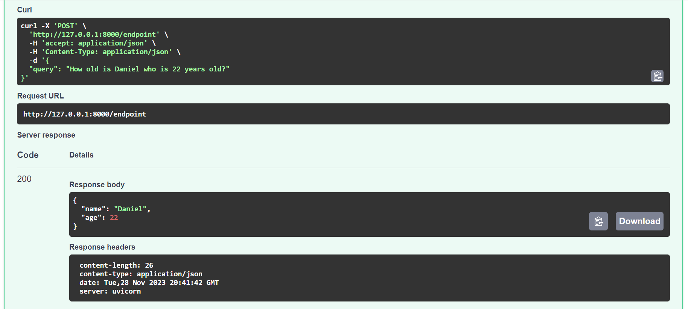

# Integrating Pydantic Models with FastAPI

[FastAPI](https://fastapi.tiangolo.com/) is an enjoyable tool for building web applications in Python. It is well known for its integration with `Pydantic` models, which makes defining and validating data structures straightforward and efficient. In this guide, we explore how simple functions that return `Pydantic` models can seamlessly integrate with `FastAPI`.

## Code Example: Starting a FastAPI App with a POST Request

The following code snippet demonstrates how to start a `FastAPI` app with a POST endpoint. This endpoint accepts and returns data defined by a `Pydantic` model.

```python
from fastapi import FastAPI
from pydantic import BaseModel
import instructor
from openai import OpenAI

# Enables response_model
client = instructor.patch(OpenAI())

class UserData(BaseModel):
    # This can be the model for the input data
    query: str

class UserDetail(BaseModel):
    name: str
    age: int

app = FastAPI()

@app.post("/endpoint", response_model=UserDetail)
def endpoint_function(data: UserData) -> UserDetail:
    user_detail = client.chat.completions.create(
        model="gpt-3.5-turbo",
        response_model=UserDetail,
        messages=[
            {"role": "user", "content": data.query},
        ]
    )
    return user_detail
```

### Utilizing FastAPI Backend as a Plugin for GPT

`FastAPI`'s compatibility with OpenAI specifications, particularly when integrated with `Pydantic` models and the `instructor` library, enhances the backend's capacity to serve as a plugin for GPT models. This integration enables a seamless connection between FastAPI's robust API development capabilities and LLMs.

#### Key Points of Integration

1. **Seamless Integration with GPT Models**: Direct interaction with GPT models using `instructor`.
2. **Enhanced Backend Functionality**: Acts as an LLM-augmented plugin for dynamic request processing.
3. **Maintaining Core FastAPI Benefits**: Automatic validation, comprehensive documentation, and ease of testing are maintained.

## Automatic Documentation with FastAPI

FastAPI leverages the OpenAPI specification to automatically generate a dynamic and interactive documentation page, commonly referred to as the `/docs` page. This feature is incredibly useful for developers, as it offers a live environment to test API endpoints directly through the browser.

### How to Use the `/docs` Page for Testing

To explore the capabilities of your API, follow these steps:

1. Run the API using the Uvicorn command: `uvicorn main:app --reload`.
2. Open your web browser and navigate to `http://127.0.0.1:8000/docs`.
3. You will find an interactive UI where you can send different requests to your API and see the responses in real-time.

### Example Queries to Try

Here are various types of queries you can test. These examples demonstrate how the API can process and understand different formats of data input:

- **Simple Direct Statements**:
  - "Identify that Sarah is 30 years old." (A straightforward statement)
  - "Note that Michael is 42 years old." (Directly provides the required information)

- **Embedded in Sentences**:
  - "During the meeting, it was mentioned that Kevin is 28 years old." (Information embedded within a sentence)
  - "In her bio, it says Emma is 35 years old." (Extracting details from a biographical note)

- **Question Format**:
  - "How old is Daniel who is 22 years old?" (Query posed as a question)
  - "What is the age of Rachel who is 29?" (Another question-based format)

Utilize the interactive UI of the `/docs` page to experiment with these queries and observe how the API processes and responds.



## Why Choose FastAPI and Pydantic?

- **Efficiency**: Simplifies the development and maintenance of APIs.
- **Scalability**: Facilitates the growth of your application.
- **Integration**: Easy integration with modern Python features and libraries.

## Conclusion

Using `FastAPI` in conjunction with `Pydantic` models not only simplifies the development of robust APIs but also ensures that they are well-documented and easy to test. This approach leads to more maintainable and scalable code, making `FastAPI` a popular choice for modern web API development.

For more detailed information and advanced usage, refer to the [FastAPI Documentation](https://fastapi.tiangolo.com/).
