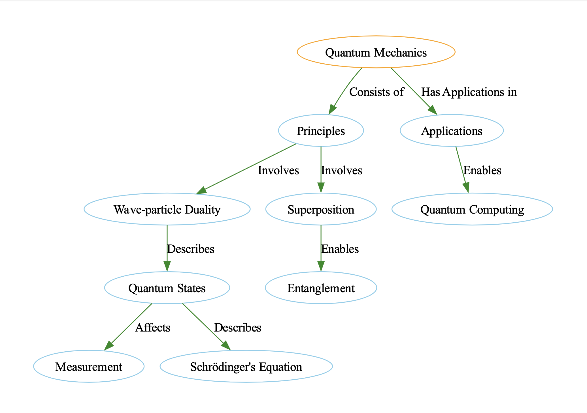

# Visualizing Knowledge Graphs for Complex Topics

In this guide, you'll discover how to visualize a detailed knowledge graph for understanding complex topics, in this case, quantum mechanics. We leverage OpenAI's API and the Graphviz library to bring structure to intricate subjects.

!!! tips "Motivation"

    Knowledge graphs offer a visually appealing and coherent way to understand complicated topics like quantum mechanics. By generating these graphs automatically, you can accelerate the learning process and make it easier to digest complex information.

## Defining the Structures

Let's model a knowledge graph with **`Node`** and **`Edge`** objects. **`Node`** objects represent key concepts or entities, while **`Edge`** objects indicate the relationships between them.

```python
from pydantic import BaseModel, Field
from typing import List

class Node(BaseModel):
    id: int
    label: str
    color: str

class Edge(BaseModel):
    source: int
    target: int
    label: str
    color: str = "black"

class KnowledgeGraph(BaseModel):
    nodes: List[Node] = Field(..., default_factory=list)
    edges: List[Edge] = Field(..., default_factory=list)
```

## Generating Knowledge Graphs

The **`generate_graph`** function leverages OpenAI's API to generate a knowledge graph based on the input query.

```python
from openai import OpenAI
import instructor

# Adds response_model to ChatCompletion
# Allows the return of Pydantic model rather than raw JSON
client = instructor.patch(OpenAI())

def generate_graph(input) -> KnowledgeGraph:
    return client.chat.completions.create(
        model="gpt-3.5-turbo",
        messages=[
            {
                "role": "user",
                "content": f"Help me understand the following by describing it as a detailed knowledge graph: {input}",
            }
        ],
        response_model=KnowledgeGraph,
    )  # type: ignore
```

## Visualizing the Graph

The **`visualize_knowledge_graph`** function uses the Graphviz library to render the generated knowledge graph.

```python
from graphviz import Digraph

def visualize_knowledge_graph(kg: KnowledgeGraph):
    dot = Digraph(comment="Knowledge Graph")

    # Add nodes
    for node in kg.nodes:
        dot.node(str(node.id), node.label, color=node.color)

    # Add edges
    for edge in kg.edges:
        dot.edge(str(edge.source), str(edge.target), label=edge.label, color=edge.color)

    # Render the graph
    dot.render("knowledge_graph.gv", view=True)
```

## Putting It All Together

Execute the code to generate and visualize a knowledge graph for understanding quantum mechanics.

```python
graph: KnowledgeGraph = generate_graph("Teach me about quantum mechanics")
visualize_knowledge_graph(graph)
```



This will produce a visual representation of the knowledge graph, stored as "knowledge_graph.gv". You can open this file to explore the key concepts and their relationships in quantum mechanics.

By leveraging automated knowledge graphs, you can dissect complex topics into digestible pieces, making the learning journey less daunting and more effective.
