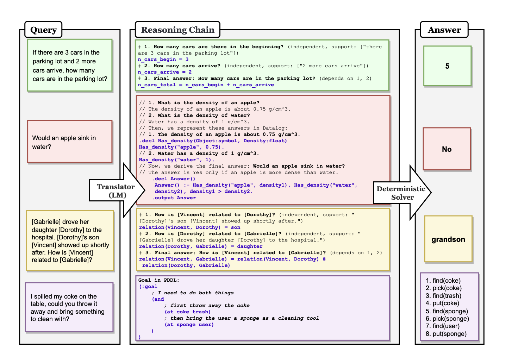

Faithful Chain of Thought<sup><a href="https://arxiv.org/pdf/2301.13379">1</a></sup> improves the faithfulness of reasoning chains generated by Language Models by breaking it up into two stages

1. **Translation** : We first translate a user query into a series of reasoning steps. These are a task specific set of steps that we can execute deterministically.
2. **Problem Solving**: We execute our steps and arrive at a final answer that we can derive. This ensures that our Chain Of Thought is able to derive a answer that is consistent with the reasoning steps.

They list a few examples in the paper of what these task-specific steps could be

1. **Math Word Problems** : Python Code that can be executed by an interpreter to derive a final answer
2. **Multi-Hop QA** : This is a multi-step reasoning process. To solve this, they use a mix of python and Datalog ( which is a relation and log programming language ) to arrive at a final answer
3. **Planning** : When trying to generate a plan to solve a user query, they generate a list of symbolic goals in a Programming Language and then call a PDDL Planner to obtain a plan to solve the user's query



In the example below, we show how you can use a LLM to generate python code that can be executed by an Interpreter to arrive at a final answer.

We can implement it in `instructor` as seen below

```python hl_lines="30-45"
import instructor
from openai import OpenAI
from pydantic import BaseModel, Field

client = instructor.from_openai(OpenAI())


class ReasoningStep(BaseModel):
    id: int = Field(description="Unique ID")
    rationale: list[str] = Field(
        description="""Specific sections from prior reasoning
        steps or the context that ground this reasoning step"""
    )
    dependencies: list[int] = Field(
        description="""IDs of prior reasoning steps that this
        reasoning step depends on"""
    )
    eval_string: str = Field(
        description="""Python Code to execute to generate the
        final evaluation"""
    )


def generate_reasoning_steps(query: str) -> list[ReasoningStep]:
    return client.chat.completions.create(
        messages=[
            {
                "role": "system",
                "content": """
                You are a world class AI who excels at
                generating reasoning steps to answer a
                question. You will be given a question
                and you will generate a list of reasoning
                steps that are needed to answer the
                question.

                At each point you should either
                - declare a variable to be referenced
                later on
                - combine multiple variables together to
                generate a new result that you should
                store in another variable

                The final answer should be stored in a
                variable called `answer`.
                """,
            },
            {"role": "user", "content": query},
        ],
        model="gpt-4-turbo-preview",
        response_model=list[ReasoningStep],
    )


if __name__ == "__main__":
    steps = generate_reasoning_steps(
        """If there are 3 cars in the parking lot and 2 more
        cars arrive, how many cars are in the parking lot
        after another 2 more arrive?"""
    )

    code = "\n".join([step.eval_string for step in steps])
    print(code)
    """
    initial_cars = 3
    arriving_cars = 2
    cars_after_first_arrival = initial_cars + arriving_cars
    final_car_count = cars_after_first_arrival + 2
    answer = final_car_count
    """
    exec(code)

    local_vars = {}
    exec(code, {}, local_vars)
    print(local_vars.get("answer"))
    #> 7
```

### References

<sup id="ref-1">1</sup>: [Faithful Chain-of-Thought Reasoning](https://arxiv.org/pdf/2301.13379)
