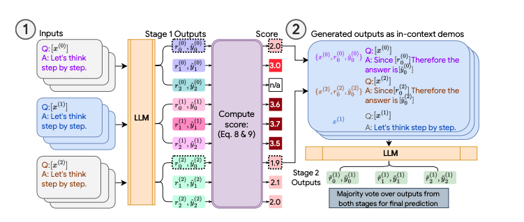
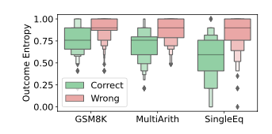

Consistency Based Self Adaptive Prompting (COSP)<sup><a href="https://arxiv.org/pdf/2305.14106">1</a></sup> aims to improve LLM output quality by generating high quality few shot examples to be included in the final prompt. These are examples without labelled ground truth so they use self-consistency and a metric known as normalized entropy to select the best examples.

Once they've selected the examples, they then append them to the prompt and generate multiple reasoning chains before selecting the final result using [Self-Consistency](self_consistency.md).

## COSP process



How does this look in practice? Let's dive into greater detail.

### Step 1 - Selecting Examples

In the first step, we try to generate high quality examples from questions that don't have ground truth labels. This is challenging because we want to find a way to automatically determine answer quality when sampling our model multiple times.

In this case, we have `n` questions which we want to generate `m` possible reasoning chains for each question. This gives a total of `nm` examples. We then want to filter out `k` final few shot examples from these `nm` examples to be included inside our final prompt.

1. Using chain of thought, we first generate `m` responses for each question. These responses contain a final answer and a rationale behind that answer.
2. We compute a score for each response using a weighted sum of two values - normalized entropy and repetitiveness ( How many times this rationale appears for this amswer )
3. We rank all of our `nm` responses using this score and choose the `k` examples with the lowest scores as our final few shot examples.

#### Normalized Entropy

> In the paper, the authors write that normalized entropy is a good proxy over a number of different tasks where low entropy is positively correlated with correctness. Entropy is also supposed to range from 0 to 1.
>
> Therefore in order to do so, we introduce a `-` term in our implementation so that the calculated values range from 0 to 1.



Assuming that for a specific question $x^{(i)}$, we have generated $m$ final answers of which $u$ are unique. ( Note that this only cares about the answer itself and not the rationale )

$$
\mathcal{H}\left(x^{(i)} \mid \left\{\hat{y}_j^{(i)}\right\}_{j=1}^m\right) = \frac{\sum_{\alpha=1}^u \hat{p}\left(\hat{y}_{\alpha}^{(i)}\right) \log \hat{p}\left(\hat{y}_{\alpha}^{(i)}\right)}{\log m},
$$

We can measure the entropy of the generated responses using the formula above where

- $x_i$ is the original question that we prompted the model with
- $y_j^{i}$ represents the $i$-th sampled response from the $m$ that we generated
- $\hat{p}\left(\hat{y}_{\alpha}^{(i)}\right)$ is the frequency of the unique answer in all the $m$ generated answers. (Eg. if we generate 8 responses and 4 of them return the value 10, then $\hat{p}\left(\hat{y}_{\alpha}^{(i)}\right)$ is just going to be 0.5)

#### Repetitiveness

$$
R_r(r_j^{(i)}) = \frac{2}{Q(Q-1)} \sum_{a=1}^{Q} \sum_{b=a+1}^{Q} W_{ab}
$$

In the formula above, $Q$ refers to the number of phrases in the sentence and $W_{ab}$ refers to the cosine similarity of two phrases $a$ and $b$.

Repetitiveness aims to measure how often the language model repeats itself. To do so, the paper sums up the cosine similarity between each sentence inside the generated chain of thought rationale before normalizing it.

The intuition behind this is that high repetitiveness indicates redundancy, which can lead to poorer performance. Therefore responses with a high number of similar sentences will have a larger score for repetitiveness ( since cosine similarity will be larger for each sentence ).

### Step 2 - Self Consistency

We now take our `k` responses and append them to our prompt. We then sample our model multiple times using this new prompt and take the majority vote as the answer.

## Implementation

Now that we understand what COSP is, let's see how we can implement it in instructor. Note that here we'll measure repetitiveness using cosine similarity between sentence embeddings.

```python
import instructor
from pydantic import BaseModel
from openai import AsyncOpenAI, OpenAI
from collections import defaultdict, Counter
import asyncio
from textwrap import dedent
import math

client = instructor.from_openai(AsyncOpenAI())


class Response(BaseModel):
    chain_of_thought: list[str]
    answer: int


class ResponseScore(BaseModel):
    query: str
    response: Response
    score: float

    def format_response(self):
        return dedent(
            f"""
            Q: {self.query}
            A: {''.join(self.response.chain_of_thought)}. Therefore the answer is {self.response.answer}.
            """
        )


def cosine_similarity(vec1: list[float], vec2: list[float]):
    dot_product = sum(a * b for a, b in zip(vec1, vec2))
    magnitude1 = math.sqrt(sum(a * a for a in vec1))
    magnitude2 = math.sqrt(sum(b * b for b in vec2))

    if magnitude1 * magnitude2 == 0:
        return 0  # Handle the case of zero vectors

    return dot_product / (magnitude1 * magnitude2)


def score_repetitiveness(prediction: Response):
    if len(prediction.chain_of_thought) == 1:
        return 0

    embedding = OpenAI().embeddings.create(
        input=prediction.chain_of_thought, model="text-embedding-3-small"
    )
    embedding = [item.embedding for item in embedding.data]

    ttl = 0
    num_comparisons = 0
    for idx in range(len(embedding)):
        for idx2 in range(idx + 1, len(embedding)):
            ttl += cosine_similarity(embedding[idx], embedding[idx2])
            num_comparisons += 1

    return ttl / num_comparisons if num_comparisons > 0 else 0


async def generate_cot_response(query: str) -> tuple[Response, str]:
    return (
        await client.chat.completions.create(
            model="gpt-4-turbo-preview",
            messages=[{"role": "user", "content": query}],
            response_model=Response,
            temperature=0.4,
        ),
        query,
    )


async def generate_batch_cot_responses(
    queries: list[str], m: int
) -> list[tuple[Response, str]]:
    coros = [generate_cot_response(query) for query in queries for _ in range(m)]
    return await asyncio.gather(*coros)


def score_entropy(predictions: list[Response]):
    counter = Counter([prediction.answer for prediction in predictions])

    prob = [counter[i] / len(predictions) for i in counter]

    numer = -sum([p * math.log(p) for p in prob])
    denom = math.log(len(predictions))

    return numer / denom


def score_responses(
    predictions: list[tuple[Response, str]], trade_off_param: float
) -> list[ResponseScore]:
    query_to_responses: dict[str, list[Response]] = defaultdict(list)
    for prediction, query in predictions:
        query_to_responses[query].append(prediction)

    query_to_entropy = {
        query: score_entropy(predictions)
        for query, predictions in query_to_responses.items()
    }

    return [
        ResponseScore(
            query=query,
            response=prediction,
            score=query_to_entropy[query]
            + trade_off_param * score_repetitiveness(prediction),
        )
        for prediction, query in predictions
    ]


def get_top_k_examples(queries: list[ResponseScore], k: int):
    """
    This gets the top k responses that have the minimum possible score
    """
    sorted_responses = sorted(queries, key=lambda x: x.score)
    return sorted_responses[:k]


async def generate_answer_with_examples(query: str, examples: list[ResponseScore]):
    formatted_examples = "\n".join([example.format_response() for example in examples])
    return await client.chat.completions.create(
        model="gpt-4-turbo-preview",
        messages=[
            {
                "role": "system",
                "content": dedent(
                    f"""
                You are a world class AI system that excels at answering user queries

                <query>
                {query}
                </query>

                <examples>
                {formatted_examples}
                </examples>
                """
                ),
            }
        ],
        response_model=Response,
    )


async def generate_final_answers(
    query: str, examples: list[ResponseScore], number_samples: int
):
    coros = [
        generate_answer_with_examples(query, examples) for _ in range(number_samples)
    ]

    return await asyncio.gather(*coros)


if __name__ == "__main__":
    query = (
        "The schools debate team had 5 boys and 40 girls on it. "
        "If they were split into groups of 9 how many groups "
        "could they make?"
    )

    example_questions = [
        (
            "Debby's class is going on a field trip to the zoo. "
            "If each van can hold 4 people and there are 2 students "
            "and 6 adults going, how many vans will they need?"
        ),
        (
            "Nancy had 80 files on her computer. She deleted 31 of "
            "them and put the rest into folders with 7 files in each "
            "one. How many folders did Nancy end up with?"
        ),
        (
            "At the arcade, Tom won 32 tickets playing 'whack a mole' "
            "and 25 tickets playing 'skee ball'. If he spent 7 of his "
            "tickets on a hat, how many tickets does Tom have left?"
        ),
    ]

    m = 2  # Number of Reasoning Chains per example ( Step 1 )
    k = 3  # Number of Examples to include in final prompt (Step 2)
    n = 2  # Number of Reasoning Chains For Self-Consistency ( Step 2 )

    # Step 1 : Generate the examples
    responses = asyncio.run(generate_batch_cot_responses(example_questions, m))
    scored_responses = score_responses(responses, 0.2)

    chosen_examples = get_top_k_examples(scored_responses, k)

    # Step 2 : Run Self-Consistency
    final_responses = asyncio.run(generate_final_answers(query, chosen_examples, n))

    c = Counter([response.answer for response in final_responses])
    answer = c.most_common(1)[0][0]

    print(answer)
    #> 5
```

### References

<sup id="ref-1">1</sup>: [Better Zero-Shot Reasoning with Self-Adaptive Prompting](https://arxiv.org/pdf/2305.14106)
