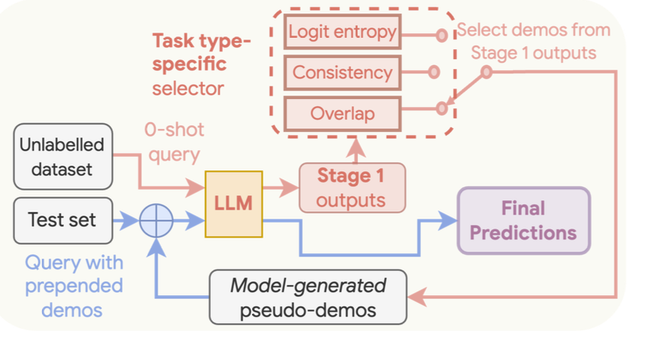

Universal Self Prompting is a two stage process similar to [Consistency Based Self Adaptive Prompting (COSP)](/cosp.md). Here is a breakdown of the two stages.

1. **Generate Examples** : LLMs are prompted to generate a collection of candidate responses using a test dataset
2. **Answer Query** : We then select a few of these model-generated responses as examples to prompt the LLM to obtain a final prediction.

Note here that the final answer is obtained using a single forward pass with greedy decoding.

## USP Process

Let's see how this works in greater detail.

### Generate Few Shot Examples

We first prompt our model to generate responses for a given set of prompts. Instead of measuring the entropy and repetitiveness as in COSP, we use one of three possible methods to measure the quality of the generated responses. These methods are decided based on the three categories supported.

This category has to be specified by a user ahead of time.

Note that for Short Form and Long Form generation, we generate $m$ different samples. This is not the case for classification tasks.

- **Classification** : Classification Tasks are evaluated using the normalized probability of each label using the raw logits from the LLM.

$$
F_{CLS}(p^{(j)}|d^{(j)}) := -\sum_{c \in C} P(c|d^{(j)}) \log P(c|d^{(j)})
$$

In short, we take the raw logit for each token corresponding to the label, use a softmax to normalize each of them and then sum across the individual probabilities and their log probs. We also try to sample enough queries such that we have a balanced number of predictions across each class ( so that our model doesn't have a bias towards specific classes )

- **Short Form Generation**: This is done by using a similar formula to COSP but without the normalizing term

$$
\mathcal{H}\left(x^{(i)} \mid \left\{\hat{y}_j^{(i)}\right\}_{j=1}^m\right) = \frac{\sum_{\alpha=1}^u \hat{p}\left(\hat{y}_{\alpha}^{(i)}\right) \log \hat{p}\left(\hat{y}_{\alpha}^{(i)}\right)}{\log m},
$$

- **Long Form Generation**: This is done by using the average pairwise ROUGE score between all pairs of the $m$ responses.

What is key here is that depending on the task specified by the user, we have a task-specific form of evaluation. This eventually allows us to better evaluate our individual generated examples. Samples of tasks for each category include

1. **Classification**: Natural Language Inference, Topic Classification and Sentiment Analysis
2. **Short Form Generation** : Question Answering and Sentence Completion
3. **Long Form Generation** : Text Summarization and Machine Translation

This helps to ultimately improve the performance of these large language models across different types of tasks.

### Generate Single Response

Once we've selected our examples, the second step is relatively simple. We just need to append a few of our chosen examples that score best on our chosen metric to append to our solution.
